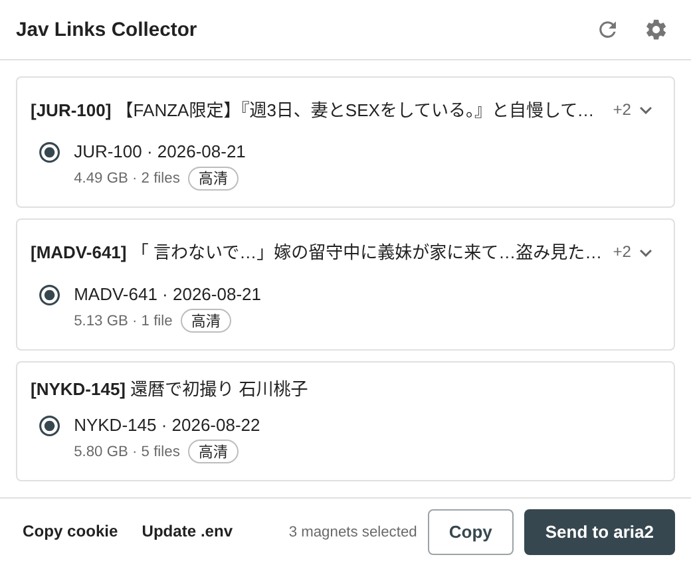
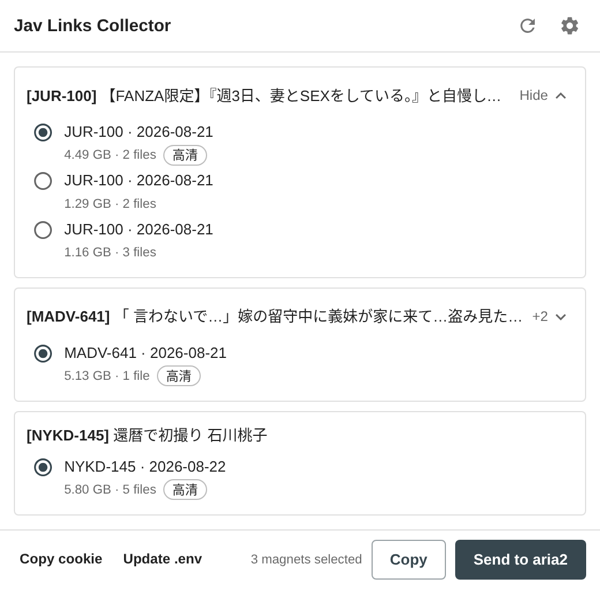
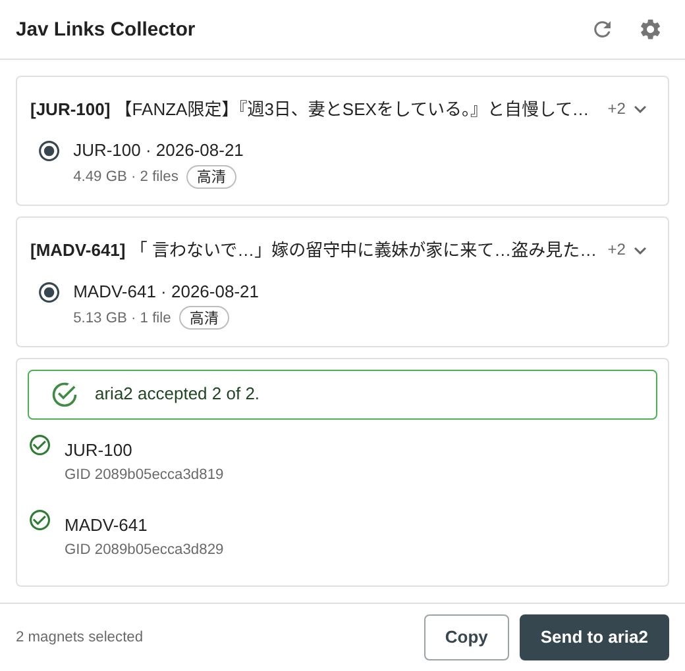
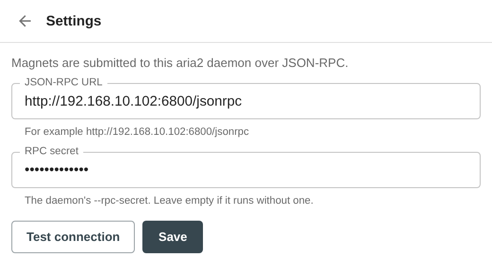

# Jav Links Collector

A Chrome extension that reads the magnet list off javdb video pages you have open and submits
your choice to an aria2 daemon over JSON-RPC.

It is one part of a three-piece pipeline. This extension puts downloads into aria2;
`avloaderServer` fetches metadata from javdb behind Cloudflare; `avLoaderClient` renames the
finished files and writes `.nfo` sidecars. Each piece runs on its own and knows nothing about the
others.

## What it does

Open one or more `https://javdb.com/v/...` pages, then click the toolbar button.



One card per javdb tab that is open right now, headed `[CODE] Title`. Each shows a single magnet:
the first one, which is javdb's own default ordering. Each magnet gives its name and date on one
line, then its size and file count. Read the size -- javdb gives every magnet of a movie the same
video code, so on a page listing three of them the first line reads identically three times and
the size is the only thing that tells them apart.

The alternatives stay folded behind a `+2` in the card's top corner, so eight open tabs is eight
rows rather than thirty. Expand a card to choose a different magnet, and it folds back once you
have.



Two things you can do with the selection:

- **Send to aria2** submits one magnet per movie, each as its own `aria2.addUri` call, and reports
  what aria2 accepted for each, with the download id it returned.
- **Copy** puts the same magnet URIs on the clipboard, one per line. That is the form a torrent
  client's "add from clipboard" expects, and the form you can paste straight into a file.



Nothing is stored between popup sessions. The list is read from the tabs themselves each time the
popup opens, so closing a tab removes it, and a page whose contents changed reports the change.

## What it does not do

- It does not work on any site other than javdb.com.
- It does not download anything itself. It hands magnet URIs to aria2, or to your clipboard, and
  stops there.
- It does not choose a download directory. aria2 decides where files land, using its own
  configuration.
- It does not keep a history, a queue, or a list of what you sent. Nothing survives closing the
  popup except the aria2 connection settings.
- It sends nothing anywhere except the aria2 endpoint you configure. There is no analytics, no
  telemetry, and no third-party request of any kind.

## Requirements

- Chrome 116 or later.
- An aria2 daemon reachable from this machine with `--enable-rpc`. If it was started with
  `--rpc-secret`, you will need that secret.

## Installing

1. Build the extension:

   ```sh
   bun install
   bun run build
   ```

2. Open `chrome://extensions/` and turn on Developer mode.
3. Click **Load unpacked** and select the `dist/` directory, not the repository root. `dist/` is
   the built output; the repository root has no `manifest.json`.

Rebuild and click the reload icon on the extension card after any source change. `bun run dev`
rebuilds on save, but Chrome still needs the reload click.

## Connecting to aria2

Open the popup and click the settings icon.



- **JSON-RPC URL** — the full path, for example `http://192.168.10.102:6800/jsonrpc`. That
  address is the shipped default and is the one origin the manifest grants outright, so it works
  with no permission prompt.
- **RPC secret** — the value passed to aria2's `--rpc-secret`, without any prefix. Leave it empty
  if the daemon runs without one.

**Test connection** calls `aria2.getVersion` and shows the version the daemon reports, which
confirms the URL, the secret, and the network path in one step. **Save** stores both values.

Testing or saving an endpoint other than the default asks Chrome for permission to reach that
host, and Chrome sometimes closes the popup to show that prompt. **Save** writes what you typed
before the prompt appears, so reopening the popup shows your values again. If you granted the
permission, you are done; if the popup closed before you could, press Save once more.

### About the secret

The secret is stored in `chrome.storage.local`. That means it stays on this machine: it is not
compiled into the extension, not committed to this repository, and not replicated through your
Google account, which `chrome.storage.sync` would have done.

It is still sent in the clear if your endpoint is `http://`. Anyone who can watch that network
segment can read it, and aria2's RPC lets a caller choose download paths. On a home LAN that is
usually an acceptable trade; on a network you do not control, put the daemon behind HTTPS or a
tunnel.

## Reading the popup

- **A tab with a warning instead of magnets** means no content script is running in it. This is
  normal for tabs that were already open when you installed or reloaded the extension. Reload the
  page.
- **"This page lists no magnet links"** means the page genuinely has none, or javdb changed its
  markup. See the note on selectors below.
- **The toolbar badge** counts javdb video tabs open right now. It is recomputed from the browser,
  not accumulated, so it is never stale.

## A note on selectors

The parser targets specific javdb markup, and all of it is declared in one block at the top of
`src/content/javdb.ts`. Whole saved pages in `tests/fixtures/` pin every one of those selectors, so
a change to that block that does not hold against real markup fails the test suite.

The parser is still built to degrade rather than fail. Each field is independently optional, and if
the structured pass finds nothing it falls back to every `magnet:` anchor on the page. So a
redesign costs you sizes, tags, and dates, not the links themselves. When that happens, save a
fresh page into `tests/fixtures/` and fix the selector block; that is the whole repair.

Sizes and dates come from each row's `data-size`, `data-files` and `data-date` attributes rather
than from the rendered text, which reads "5.80GB, 5個文件" and follows the site's language setting.
The text is the fallback.

## Permissions

| Permission | Why |
|---|---|
| `storage` | Holds the aria2 URL and secret. Nothing else is stored. |
| `https://javdb.com/v/*` | Injects the content script, and lets the popup see the title and URL of javdb video tabs. This is narrower than the `tabs` permission, which would expose every tab. |
| `http://192.168.10.102:6800/*` | The default aria2 endpoint, granted so the common case needs no prompt. |
| `optional_host_permissions` (`http://*/*`, `https://*/*`) | Lets the extension ask for one origin at a time. Both **Test connection** and **Save** request permission for whatever endpoint is in the field, and only for that host. |

## Development

```sh
bun install
bun run build       # bundle into dist/
bun run dev         # rebuild on change
bun test            # unit tests
bun run typecheck   # tsc --noEmit
bun run screenshots # redraw docs/*.png
```

`bun run screenshots` mounts the real popup against `tests/fixtures/` with a stubbed `chrome` API
and photographs it in headless Chromium, so the images above are the actual components rendering
actual parsed pages rather than mockups. It needs `chromium` on PATH (override with `CHROMIUM=`)
and CJK fonts installed, or the Japanese titles come out as empty boxes.

```
src/
  manifest.json
  background/index.ts    service worker; maintains the toolbar badge and nothing else
  content/index.ts       answers the popup's request for the current page
  content/javdb.ts       the javdb parser and every javdb-specific selector
  popup/                 React and Material UI popup
  shared/aria2.ts        aria2 JSON-RPC client
  shared/format.ts       size, info hash, and display-name parsing
  shared/messages.ts     the one message type, and how the popup asks for it
  shared/settings.ts     settings storage, validation, and host permissions
  shared/types.ts        the shapes that cross the messaging boundary
scripts/build.ts         bundles each entry point separately as an IIFE
scripts/generate-icons.ts draws the toolbar icons; no binaries are committed
scripts/screenshot.ts    renders the popup against the fixtures for docs/
scripts/harness/         the stubbed-chrome page those screenshots photograph
tests/
  fixtures/              whole javdb pages saved from a browser
docs/                    the screenshots in this README
```

Two design decisions are worth knowing before changing anything.

**Each magnet gets its own `aria2.addUri` call.** That method takes an array of URIs pointing at
the *same* resource -- a mirror list, not a batch -- and for a magnet the array must hold exactly
one element. Passing several unrelated magnets in one call registers the first and discards the
rest without reporting an error.

**The content script never pushes.** `chrome.runtime.sendMessage` broadcasts to every extension
context at once, so a script that volunteers state is delivered to the service worker and the popup
alike; forwarding it again from the worker produces a second copy whose sender has no tab. The
popup pulls from each tab instead, with `chrome.tabs.sendMessage`, which is addressed to one
recipient. There is no other message in the extension.

There is also no timer anywhere. A Manifest V3 service worker is evicted after roughly thirty
seconds of inactivity, and a pending timer neither keeps it alive nor survives termination, so
`setInterval` housekeeping in a worker never runs. Nothing here outlives an open tab, so nothing
needs cleaning up.
